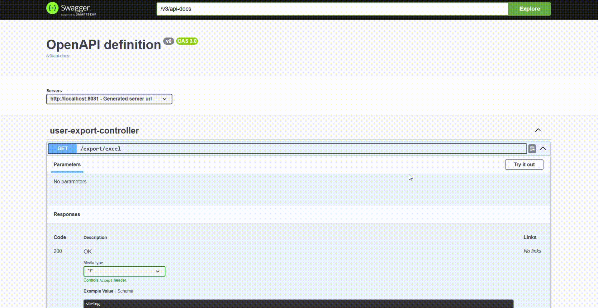
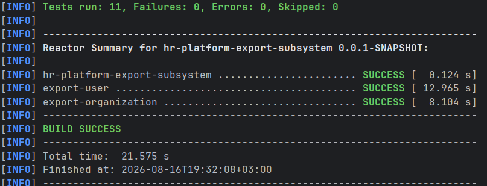

# HR Platform - Export Subsystem (Microservices)

A production-ready microservice subsystem designed for high-performance data export (Excel/CSV) within an enterprise HR platform. Built using **Java 21**, **Spring Boot 3.5**, and **Spring Cloud**, utilizing **Docker Compose** for containerized orchestration and automated data seeding.

## Architecture Overview

The subsystem consists of two isolated microservices communicating synchronously via HTTP REST:
* **`export-user` (Port 8081)**: The core orchestration service. It handles client requests, processes employee records, and streams generated reports. It acts as an OpenFeign client to fetch organization meta-data.
* **`export-organization` (Port 8082)**: A dedicated microservice managing organization structures and legal profiles.

## 📺 Demonstration

<p align="center">
  
  <br>
  <em>Figure 1: Demonstration of synchronous report generation via Swagger UI using OpenFeign data enrichment.</em>
</p>
<p align="center">
  
  <br>
  <em>Figure 2: Execution logs confirming 100% pass rate for all unit and service isolation tests.</em>
</p>

## ⚡ Key Technical Features & Patterns

* **Multi-Module Maven Architecture**: Unified dependency, property, and lifecycle management via a central root parent `pom.xml`.
* **Synchronous Inter-Service Communication**: Implemented robust internal data fetching using **Spring Cloud OpenFeign**.
* **Fault Tolerance & Resilience**: Configured Feign clients with active **Circuit Breaker** fallbacks. If the organization service experiences downtime, the system logs the incident and populates missing fields with safe default representations, preventing cascading system failures.
* **Complex Data Mapping**: Utilized **MapStruct** compiled tightly with **Lombok** annotation processors to handle layered DTO aggregation (combining full names and assembling legal profile details) with zero runtime overhead.
* **Memory-Efficient Streaming**: Leveraged **Apache POI SXSSFWorkbook** (streaming extension) with custom buffer windows (100 rows) and active disk cleanup (`wb.dispose()`). This keeps the JVM Heap usage low and strictly prevents `java.lang.OutOfMemoryError` when exporting massive enterprise sheets.
* **Isolated Database Isolation**: Configured independent PostgreSQL instances via an optimized Docker stack.
* **Automated Data Seeding**: Integrated automatic table filling via native Spring `data.sql` execution, ensuring the application is fully operational with dummy data immediately upon deployment.

## 🛠️ Tech Stack

* **Backend**: Java 21, Spring Boot 3.5.0, Spring Cloud OpenFeign
* **Data Processing**: Apache POI 5.2.5 (SXSSF Streaming), OpenCSV 5.9, MapStruct 1.5.5.Final, Lombok
* **Database & Persistence**: PostgreSQL 15, Spring Data JPA, Hibernate
* **DevOps**: Docker, Docker Compose

## 🚀 Quick Start (Local Deployment)

### Prerequisites
Make sure you have **Docker Desktop** installed and running.

### Execution
Run the following command in the root repository directory to build the modules and start the environment:

```bash
docker-compose up --build -d
```

### Verification & Smoke Test
You can trigger the asynchronous-ready report download using `curl` or by visiting the endpoint directly in your browser:

```bash
curl -X 'GET' 'http://localhost:8081/export/excel' -H 'accept: */*'
```

*Expected Result*: `HTTP 200 OK` response with `Content-Type: application/vnd.openxmlformats-officedocument.spreadsheetml.sheet` downloading a valid, pre-filled Excel file with Russian encoding (`Пользователи.xlsx`).

## 📄 License
This project is licensed under the MIT License - see the [LICENSE](LICENSE) file for details.
